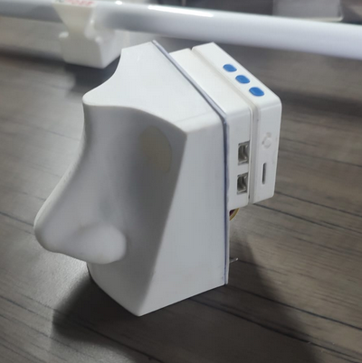

# 🧠 Artificial Nose – Smell Classification using Machine Learning

The **Artificial Nose** is a machine learning-based embedded system designed to classify various smells such as coffee, tea, vinegar, and perfume. It mimics the human olfactory system using a **multi-channel gas sensor**, **temperature and humidity sensor**, and ML models to identify smells in real-time.
<p align="center">
  &nbsp;&nbsp;&nbsp;&nbsp;&nbsp;&nbsp;
  
&nbsp;&nbsp;&nbsp;&nbsp;&nbsp;&nbsp;&nbsp;&nbsp;&nbsp;&nbsp;&nbsp;&nbsp;&nbsp;&nbsp;&nbsp;&nbsp;&nbsp;&nbsp;&nbsp;&nbsp;&nbsp;
  
</p>

##  Project Summary

- **Sensors Used:**
  - **Multichannel Gas Sensor V2** – Captures readings like NO2, Ethanol, VOC, CO.
  - **DHT22 Sensor** – Records temperature and humidity.
- **Controller:**
  - **Wio Terminal** – Used for data collection, processing, and displaying real-time results.

##  Data & Features

The system uses the following sensor values as input features:

- `Humidity`, `Temperature`, `NO2`, `Ethanol`, `VOC`, `CO`
- `Label` – The type of smell (e.g., Tea, Coffee, etc.)
- `Location` – The environment where data is collected (e.g., Office or Pantry)

###  Smell Categories

1. Coffee  
2. Tea  
3. Vinegar  
4. Perfume  
5. Normal Air (No smell)

The dataset includes both **raw unbalanced data** and a **processed balanced dataset** using SMOTE (Synthetic Minority Over-sampling Technique).

---

## Machine Learning Approaches

This project implements **three ML pipelines** for smell classification:

### 1. Edge Impulse

- Cloud-based TinyML platform for training and deployment.
- [Live Dashboard (Edge Impulse)](https://studio.edgeimpulse.com/public/692869/live)

### 2. Classic Machine Learning

- Implemented using:
  - **Decision Tree Classifier**
  - **K-Nearest Neighbors (KNN)**
- Balanced datasets using SMOTE.

### 3. Deep Learning (Neural Network)

- Built using a **Sequential Dense Neural Network**
- Deployed using **TensorFlow Lite (TFLite)** for embedded inference

---

## Experimental Setup

- **Environment 1:** Office  
- **Environment 2:** Pantry

Multiple samples were collected in each environment to increase model robustness and simulate real-world variation.

---

## Repository structure

- **Code:** Contains the arduino code and the python scripts for data collection and logging.
- **datsets:** Contains two datsets bascially. One is raw dataset and the other one is limited to 250 samples
- **hardware:** Contains the datasheets of the sensors and wioterminal. It also contains the official website documentation for each hardware components. Also contains a folder **libraries** which is the required library to be installed in **Arduino IDE**
- **images:** Contains the images of plaforms and final product result.
- **ml pipeline:** Contains the ml notebooks used and the edge impulse files
- **Documentation:** Document for reference.

---

## Applications

- Smart cooking assistants and gas leak detectors
- Environmental monitoring
- Industrial safety systems
- Medical diagnostics (e.g., detecting diseases via breath analysis)
- Quality control in food & beverage industries

---

## How to Use

- Clone this repository:
   ```bash
   git clone https://gitlab.com/sid2ko3/artificial-nose.git
   cd artificial-nose

## Author

- Sidharth N Krishna - Edge Analytics Intern, ICFOSS
- GitHub: github.com/Sidharth-NK
- Email: sid4official@gmail.com

## License

This project is licensed under the MIT License. See the LICENSE file for more details.

